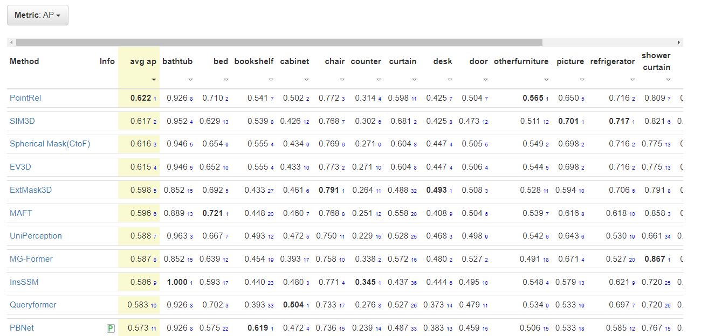
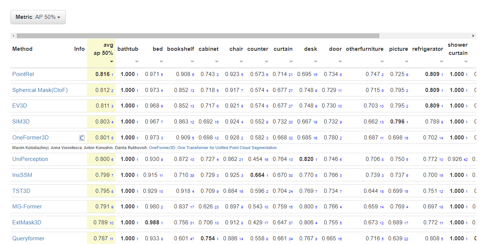
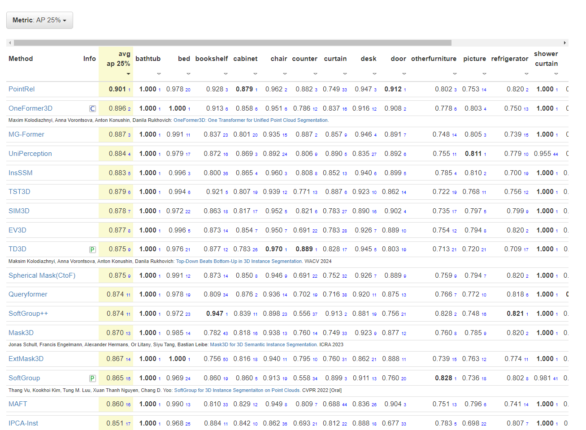

## Relation3D: Enhancing Relation Modeling for Point Cloud Instance Segmentation

**News**:
 * :fire: October, 2024. Relation3D achieves state-of-the-art performance in mAP, AP@50, and AP@25 on the hidden test set of ScanNetv2.  
   * 3D instance segmentation on ScanNet ([hidden test](https://kaldir.vc.in.tum.de/scannet_benchmark/semantic_instance_3d))
     
     

        
leaderboard screenshot

        

        
        

        
        

        
        

        

        
        

     

